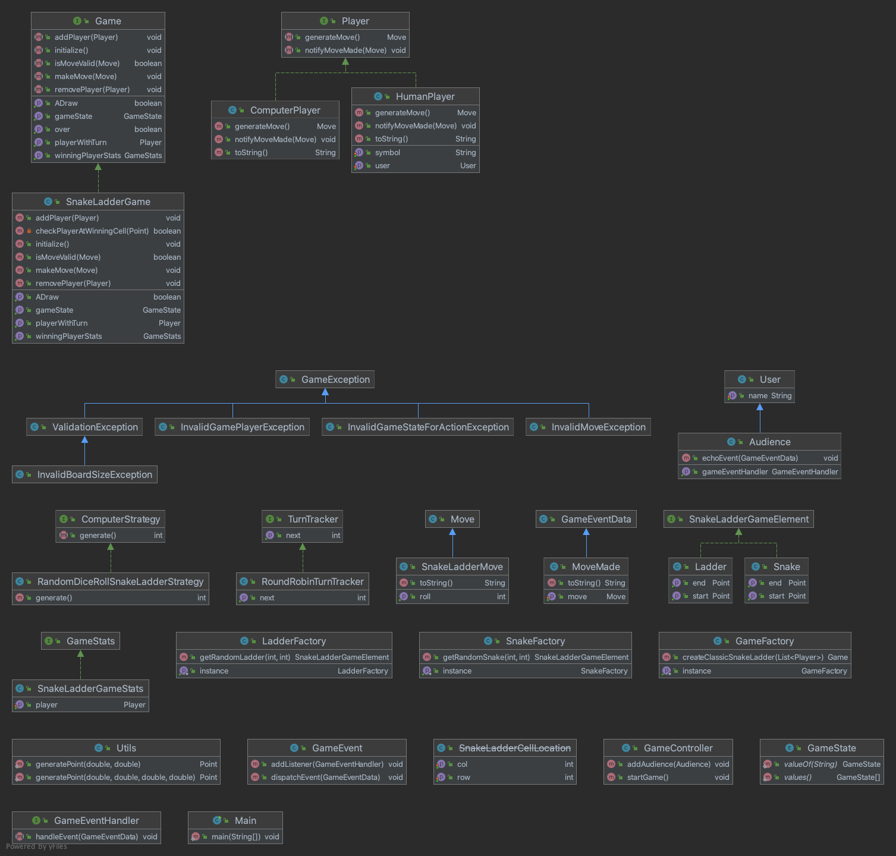

# Snake & Ladder - A Comprehensive Low-Level Design Implementation

A production-grade Snake & Ladder game built with enterprise-level architecture, demonstrating mastery of design patterns, clean code principles, and extensible system design.

## 🎯 Project Overview

This project showcases how a simple game can be elevated into a **scalable, maintainable, and extensible system** through thoughtful architectural decisions. It's designed to be both an educational reference for LLD concepts and a practical demonstration of professional software engineering practices.

## ✨ Key Features

### 1. **Event-Driven Pub/Sub Architecture**
- Decoupled component communication through **Observer pattern**
- GameEventHandler interface for event subscribers
- MoveMade events notify all interested parties without tight coupling
- Extensible for adding new event types and listeners

### 2. **Configurable Difficulty Levels**
- **Adjustable Board Dimensions**: Configure width and height (minimum 3x3)
- **Dynamic Element Count**: Set custom numbers of snakes and ladders
- **Adaptive Gameplay**: Board complexity scales with configuration
- Validation ensures valid board configurations

### 3. **Flexible Dice Input Strategies**
- **Automated Mode** (RandomDiceRollSnakeLadderStrategy)
  - True random dice rolls for computer players
  - Thread-safe Singleton implementation
  - Perfect for AI and automated testing
  
- **Manual Mode** (UserInputDiceRollSnakeLadderStrategy)
  - Player-controlled dice input (1-6)
  - Input validation with recursive error handling
  - Interactive gameplay experience

### 4. **Rich Board Rendering**
- **Visual Board State** with emoji-based representation:
  - 🐍 Snake heads | 🤕 Snake tails
  - 🪜 Ladder starts | 😃 Ladder ends
  - Player symbols and real-time positions
- **Dynamic Formatting**: Cell sizes adapt to content
- **Grid Layout**: Clear board visualization with borders
- **Player Location Tracking**: Displays coordinates for all players

### 5. **Human vs Computer Gameplay**
- **HumanPlayer**: Manual decision-making with user input
- **ComputerPlayer**: Automated strategies for AI opponents
- **Polymorphic Player Interface**: Same interface for both player types
- **RoundRobinTurnTracker**: Fair, sequential turn management
- Support for multiple players simultaneously

### 6. **Randomized Game Elements**
- **SnakeFactory & LadderFactory**: Dynamic random element generation
- **Unique Gameplay**: Different element placements each game
- **Placement Validation**: Prevents overlaps and invalid configurations
- **Deep Cloning**: Immutable elements for thread safety

---

## 🏗️ Design Patterns

| Pattern | Usage | Benefit |
|---------|-------|---------|
| **Builder** | SnakeLadderGame configuration | Fluent, readable API; validation at build time |
| **Factory** | SnakeFactory, LadderFactory | Centralized element creation; easy to modify |
| **Singleton** | Dice roll strategies | Single instance per strategy; thread-safe with double-checked locking |
| **Observer** | GameEventHandler & events | Decoupled event subscribers; extensible architecture |
| **Template Method** | GameState pattern | Common game lifecycle; subclasses define specifics |
| **State** | GameStates (WaitingForPlayers, Started, Ended) | Clear state transitions; encapsulated behavior per state |
| **Strategy** | DiceRollSnakeLadderStrategy | Pluggable algorithms; runtime strategy selection |

---

## 📦 Project Structure

```
src
└── com/games/snakeladder/
    ├── Main.java                              - Entry point
    │
    ├── utils/                                 - Utility functions
    │   ├── Utils.java
    │   └── GameController.java                - Responsible for the game flow
    │
    ├── players/                               - Player abstractions
    │   ├── Player.java                        - Core player interface
    │   ├── HumanPlayer.java                   - Manual player implementation
    │   ├── ComputerPlayer.java                - Bot player implementation
    │   ├── User.java                          - User entity
    │   └── Audience.java                      - Observer/listener
    │
    ├── game/                                  - Core game logic
    │   ├── Game.java                          - Game interface
    │   ├── SnakeLadderGame.java               - Main game implementation (+ Builder pattern)
    │   ├── GameFactory.java                   - Game creation factory
    │   │
    │   ├── stats/                             - Game statistics
    │   │   ├── GameStats.java                 - Statistics interface
    │   │   └── SnakeLadderGameStats.java      - Concrete stats implementation
    │   │
    │   └── state/                             - State machine (State pattern)
    │       ├── State.java                     - State interface
    │       ├── GameStates.java                - Enum of game states
    │       ├── WaitingForPlayersState.java    - Initial state
    │       ├── GameStartedState.java          - Active gameplay state
    │       └── GameEndedState.java            - Terminal state
    │
    ├── events/                                - Event-driven architecture (Observer pattern)
    │   ├── GameEvent.java                     - Event interface
    │   ├── GameEventData.java                 - Event payload
    │   ├── GameEventHandler.java              - Observer interface
    │   └── MoveMade.java                      - Concrete event
    │
    ├── dice/                                  - Dice mechanics (Strategy pattern)
    │   ├── DiceRollSnakeLadderStrategy.java   - Strategy interface
    │   ├── Move.java                          - Move interface
    │   │
    │   └── impl/                              - Strategy implementations
    │       ├── RandomDiceRollSnakeLadderStrategy.java    - Auto random dice (Singleton)
    │       ├── UserInputDiceRollSnakeLadderStrategy.java - Manual input (Singleton)
    │       ├── ComputerDiceRollSnakeLadderStrategy.java  - Bot strategy
    │       └── SnakeLadderMove.java           - Concrete move
    │
    ├── elements/                              - Game board elements
    │   ├── SnakeLadderGameElement.java        - Base interface
    │   ├── Snake.java                         - Snake implementation
    │   └── Ladder.java                        - Ladder implementation
    │
    ├── factories/                             - Element factories (Factory pattern)
    │   ├── SnakeFactory.java                  - Generates random snakes
    │   └── LadderFactory.java                 - Generates random ladders
    │
    ├── turntracker/                           - Turn management
    │   ├── TurnTracker.java                   - Turn tracker interface
    │   └── RoundRobinTurnTracker.java         - Round-robin implementation
    │
    └── exceptions/                            - Custom exception hierarchy
        ├── GameException.java                 - Base exception
        ├── InvalidMoveException.java          - Invalid move attempt
        ├── InvalidGamePlayerException.java    - Player not in game
        ├── InvalidGameStateForActionException.java - Wrong game state
        │
        └── validation/
            ├── ValidationException.java       - Validation base
            └── InvalidBoardSizeException.java - Board size violation
```

---

## 🏛️ Architecture Highlights

### Event-Driven Communication
```
Player → Move → Event → EventHandler → Subscribers (Audience)
```
Components are loosely coupled through event publishing and subscription.

### State Management
Clear state transitions ensure valid game operations:
- **WaitingForPlayers**: Accepting players
- **GameStarted**: Active gameplay
- **GameEnded**: Game concluded, winner determined

### Extensibility Points
- Add new player types by implementing `Player` interface
- Add new dice strategies by implementing `DiceRollSnakeLadderStrategy`
- Add new game events by extending `GameEvent`
- Add new observers by implementing `GameEventHandler`

---

## 🔧 Technical Excellence

- **Type Safety**: Comprehensive custom exceptions for all error scenarios
- **Thread Safety**: Singleton implementations with synchronized double-checked locking
- **Separation of Concerns**: Modular design with single responsibility per class
- **Immutability**: Deep cloning prevents unintended mutations
- **Validation**: Input validation at boundaries with meaningful error messages
- **Scalability**: Generic game framework easily extended to other games

---

## 📊 Class Diagram



---

## 🚀 Getting Started

### Compile & Run
```bash
javac -d bin src/com/games/snakeladder/**/*.java
```

### Run
```bash
java -cp bin com.games.snakeladder.Main
```

---

## 💡 Learning Path

This project demonstrates:
1. How to apply SOLID principles in practice
2. Design patterns in real-world scenarios
3. Building extensible, maintainable systems
4. Professional exception handling
5. Event-driven architecture patterns

Perfect for interview preparation or understanding enterprise-level design thinking!

---

